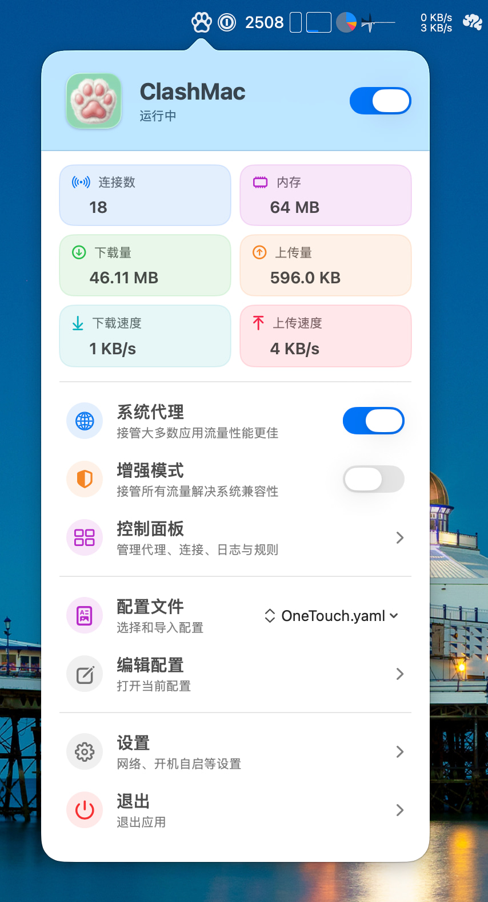

 

  

<h1 align="center">ClashMac</h1>
<h3 align="center" style="margin-top: 0; margin-bottom: 20px;">轻量级 macOS Clash 菜单栏客户端</h3>

  

  

## 特性

- **原生应用** - SwiftUI 开发，完美融入系统
- **轻量高效** - 菜单栏应用，资源占用低
- **网络接管** - 一键开启/关闭 系统代理&增强模式
- **实时流量监控** - SSE 推送，毫秒级更新
- **可视化面板** - 流量统计、连接数、内存使用
- **Web Dashboard** - 集成控制面板访问

## 下载安装

在 [Releases 页面](https://github.com/666OS/ClashMac/releases/latest) 下载最新版本：

- **Apple Silicon (M1/M2/M3/M4)**: `ClashMac-v*-macos-arm64.zip`
- **Intel Mac**: `ClashMac-v*-macos-x86_64.zip`

**安装步骤**：
1. 解压下载的 zip 文件
2. 将 `ClashMac.app` 拖到"应用程序"文件夹
3. 首次打开时，右键点击并选择"打开"（绕过安全检查）

**提示**: 不确定您的 Mac 类型？点击左上角  → 关于本机，查看"芯片"信息。

## 致谢

- [mihomo](https://github.com/MetaCubeX/mihomo) - 强大的内核
- [Vernesong](https://github.com/vernesong/mihomo) - Smart 内核开发
- [Zashboard](https://github.com/Zephyruso/zashboard) - Web 控制面板

---

  Made with ❤️ for macOS

