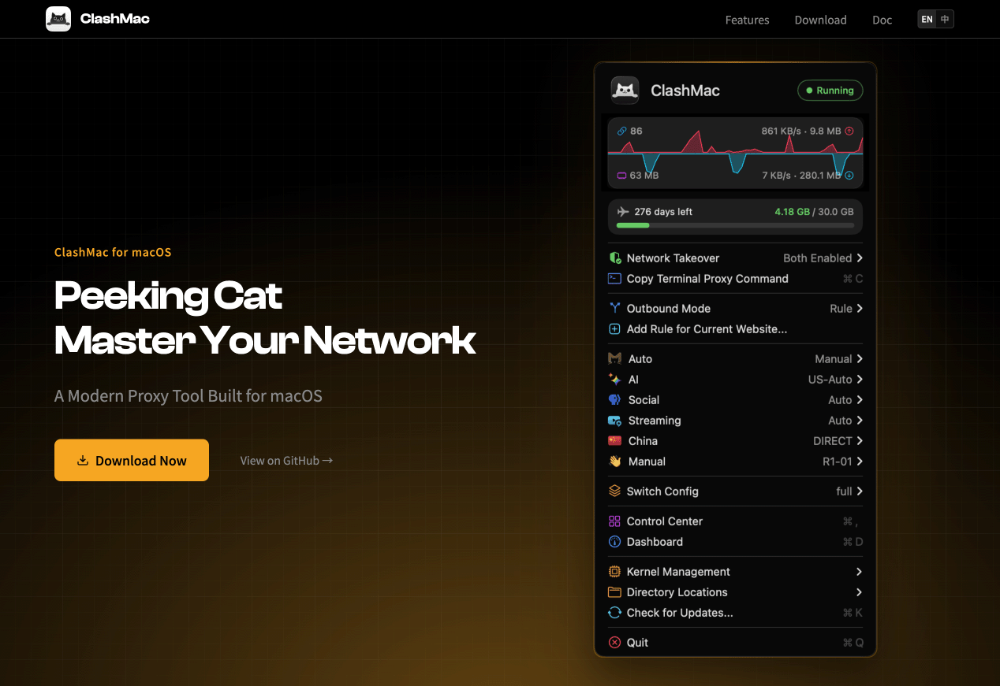
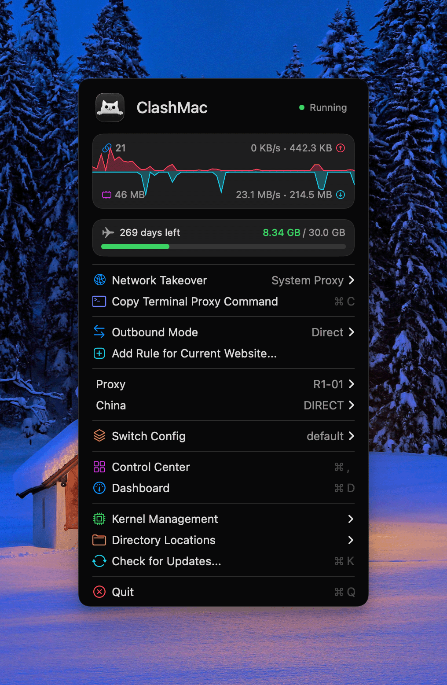
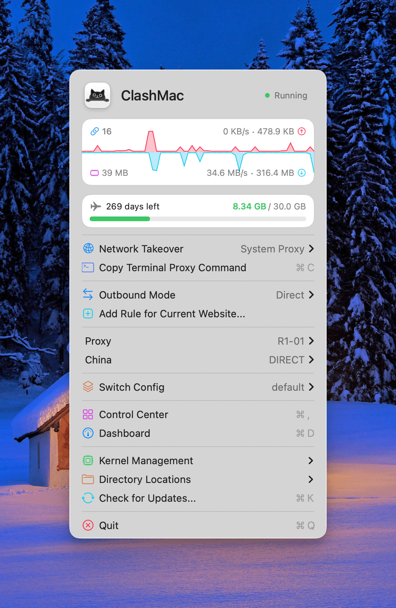
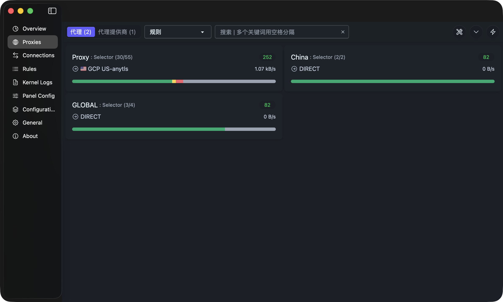

<div align="center">

**Languages:** [English](README.md) | [简体中文](README.zh-CN.md)

</div>


<p align="center">
  
</p>
<h1 align="center">ClashMac</h1>
<h3 align="center" style="margin-top: 0; margin-bottom: 10px;">Lightweight macOS Clash Menu Bar Client</h3>
<p align="center">
  🌐 <a href="https://clashmac.app"><strong>Official Website: clashmac.app</strong></a>
</p>

<p align="center" style="margin-top: 0; margin-bottom: 20px;">
  <a href="https://github.com/666OS/ClashMac/releases/latest">
    
  </a>
  <a href="https://github.com/666OS/ClashMac/releases">
    
  </a>
  <a href="https://clashmac.app">
    
  </a>
  <a href="https://t.me/Pinched666">
    
  </a>
</p>

<p align="center">
  <a href="https://clashmac.app">
    
  </a>
</p>

## Preview
<table>
  <tr>
    <th>Dark</th>
    <th>Light</th>
  </tr>
  <tr>
    <td></td>
    <td></td>
  </tr>
  <tr>
    <td colspan="2" align="center"></td>
  </tr>
</table>

## Features

- **Native Application**: Built with SwiftUI, seamlessly integrated with macOS
- **Lightweight & Efficient**: Menu bar app with minimal resource usage
- **Dual Proxy Modes**: System Proxy (HTTP/SOCKS5) + Enhanced Mode (TUN), can be enabled independently or simultaneously
- **Control Center**: Integrated Zashboard on macOS 13+, with Overview, Proxies, Connections, Rules, Logs modules
- **Password-Free Operation**: One-click privileged helper installation, no password required for system proxy and kernel management
- **Local Configurations**: Import local YAML/YML config files, auto-switch and apply
- **Remote Subscriptions**: Remote config import with auto-update, smart naming, and URL validation
- **Real-Time Statistics**: Menu bar displays live upload/download speeds, active connections, memory usage
- **Smart Configuration**: Auto-completion for DNS, TUN, GEO databases and other required parameters, respects user customizations
- **Proxy Groups**: Switch proxy nodes directly from menu, with latency testing support
- **Keyboard Shortcuts**: `⌘S` System Proxy | `⌘E` Enhanced Mode | `⌘D` Control Center | `⌥G/R/D` Global/Rule/Direct, etc.
- **Config Pre-Check**: Auto-validation before switching or importing configs, error popup with quick edit support
- **Crash Detection**: Auto-identifies kernel crash causes (Smart strategy, TUN permissions, etc.), provides solutions
- **Customizable UI**: Menu items visibility configurable, streamline interface as needed
- **App Updates**: Auto-detect new versions, one-click download and install with real-time progress
- **Launch at Login**: Supports auto-start on macOS 11.5+
- **Multi-Language**: Bilingual UI (English/Chinese), auto-follows system language
- **Probe Kitty**: Brand new app icon, adaptive to light/dark mode
- **Page Rules**: One-click add proxy rules for current webpage, supports major browsers

## Download

Download the latest version from the [Releases page](https://github.com/666OS/ClashMac/releases/latest):

- **Apple Silicon (M1/M2/M3/M4)**: `ClashMac-v*-macos-arm64.zip`
- **Intel Mac**: `ClashMac-v*-macos-x86_64.zip`

**Compatible Configuration**: Please refer to [Test Configurations](https://github.com/666OS/YYDS/tree/main/mihomo/config)

**Installation Steps**:
1. Unzip the downloaded zip file
2. Drag `ClashMac.app` to the "Applications" folder
3. On first launch, right-click and select "Open" (to bypass security check)

**Tip**: Not sure which Mac you have? Click the  menu at the top left → About This Mac, and check the "Chip" information.

> **Note: Mac Gatekeeper may block unsigned applications**  
> Since ClashMac is not Apple notarized, macOS will not allow it to open directly by default.

### Solutions

#### Method 1: Allow in System Settings
1. Try to open ClashMac, click "Done" when the security warning appears
2. Open **System Settings** → **Privacy & Security**
3. Scroll down and find the message: "ClashMac was blocked from opening"
4. Click "Open Anyway" next to it
5. Click "Open Anyway" again in the popup dialog

#### Method 2: Remove Restrictions via Terminal
Enter in Terminal:

```bash
xattr -cr /Applications/ClashMac.app
```
Press Enter and reopen the application


#### Method 3: Remove Quarantine Attribute

Enter in Terminal:
```bash
xattr -d com.apple.quarantine /Applications/ClashMac.app
```
Press Enter and reopen the application

## ⚠️ Important Notice

The main project is currently not open source. This repository is primarily for publishing releases and collecting feedback.  
All third-party open-source components used in this application have their licenses publicly disclosed as required.

We will evaluate whether to open more content in the future based on project progress.  
Thank you for your understanding and support! For more details, please refer to the [Pinned Announcement](https://github.com/666OS/ClashMac/issues/15)

## License

ClashMac is a proprietary, closed-source application.  
Only binary releases are provided in this repository.

This project uses third-party open-source components.  
The full list of licenses is available at:

[THIRD_PARTY_LICENSES](https://github.com/666OS/ClashMac/blob/main/THIRD_PARTY_LICENSES.txt) 

## Acknowledgments

- [mihomo](https://github.com/MetaCubeX/mihomo)
- [Vernesong](https://github.com/vernesong/mihomo)
- [Zashboard](https://github.com/Zephyruso/zashboard)

## Star History
[](https://star-history.com/#666OS/ClashMac&Date)

---

<p align="center">
  Made with ❤️ for macOS
</p>
